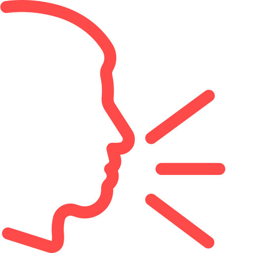

<div align="center">

  
  <h1>Ra8ayen Chat App</h1>

  <p>
    A JavaFX desktop chat application that uses a RMI to connect multiple clients together.
  </p>


<!-- Badges -->
<p>
  <a href="https://github.com/Hakugami/Ra8ayen-Chat-App/graphs/contributors">
    
  </a>

  <a href="https://github.com/Hakugami/Ra8ayen-Chat-App/stargazers">
    
  </a>
</p>

</div>

<br />

<!-- Table of Contents -->
# :notebook_with_decorative_cover: Table of Contents

- [About the Project](#star2-about-the-project)
    * [Screenshots](#camera-screenshots)
    * [Tech Stack](#space_invader-tech-stack)
    * [Features](#dart-features)
    * [Color Reference](#art-color-reference)
    * [Environment Variables](#key-environment-variables)
- [Getting Started](#toolbox-getting-started)
    * [Prerequisites](#bangbang-prerequisites)
    * [Installation](#gear-installation)
    * [Run Locally](#running-run-locally)
- [Contributing](#wave-contributing)
- [Contact](#handshake-contact)
- [Acknowledgements](#gem-acknowledgements)


<!-- About the Project -->
## :star2: About the Project


<!-- Screenshots -->
### :camera: Screenshots

<div align="center"> 
  
</div>


<!-- TechStack -->
### :space_invader: Tech Stack

<details>
  <summary>Client</summary>
  <ul>
    <li><a href="https://openjfx.io/">JavaFX</a></li>
    <li><a href="https://docs.oracle.com/javafx/2/get_started/fxml_tutorial.htm">FXML</a></li>
    <li><a href="https://en.wikipedia.org/wiki/CSS">CSS</a></li>
    <li><a href="https://gluonhq.com/products/scene-builder/">SceneBuilder</a></li>
  </ul>
</details>

<details>
  <summary>Server</summary>
  <ul>
    <li><a href="https://www.java.com/en/">Java</a></li>
    <li><a href="https://docs.oracle.com/javase/8/docs/technotes/guides/jdbc/">JDBC</a></li>
    <li><a href="https://docs.oracle.com/javase/tutorial/rmi/">RMI</a></li>
    <li><a href="https://github.com/pierredavidbelanger/chatter-bot-api/tree/v2#java">Chatter Bot</a></li>
    <li><a href="https://www.digitalocean.com/community/tutorials/javamail-example-send-mail-in-java-smtp">Java Mail</a></li>
    <li><a href="https://mapstruct.org/">Map Struct</a></li>
  </ul>
</details>

<details>
<summary>Database</summary>
  <ul>
    <li><a href="https://www.mysql.com/">MySQL</a></li>
  </ul>
</details>

<!-- Features -->
### :dart: Features

- Group Chat
- Voice Chat
- Blocking Contact
- Sending Files
- Email Sending on Invitation
- Chat Bot to answer on your behalf
- Changing your status
- Updating your profile
- Showing statistics about online/offline users
- Showing statistics about the gender
- Showing statistics about the country
- Table View for the admin showing users
- Ability to send announcements to all users
- Ability to start and shutdown server

<!-- Color Reference -->
### :art: Color Reference

| Color             | Hex                                                                |
| ----------------- | ------------------------------------------------------------------ |
| Primary Color |  #222831 |
| Secondary Color |  #393E46 |
| Text Color |  #EEEEEE |


<!-- Getting Started -->
## 	:toolbox: Getting Started

<!-- Prerequisites -->
### :bangbang: Prerequisites

This project requires Java JDK 21. Make sure you have installed it on your system. You can check by running the following command in your terminal:

```bash
java -version
```

This project uses Maven as a build tool and package manager. Make sure you have it installed on your system. You can check by running the following command in your terminal:

```bash
mvn -v
```

<!-- Run Locally -->
### :running: Run Locally

Clone the project

```bash
  git clone https://github.com/Hakugami/Ra8ayen-Chat-App
```

Go to the project directory

```bash
  cd Ra8ayen-Chat-App
```

Compile and package the project using Maven:

```bash
  mvn clean package
```

To run the server, navigate to the server directory and run the following command:

```bash
  java -jar Server/target/Server-1.0-SNAPSHOT-shaded.jar
```

To run the client, navigate to the client directory and run the following command:

```bash
  java -jar Client/target/Client-1.0-SNAPSHOT-shaded.jar
```

<!-- Contributing -->
## :wave: Contributing

<a href="https://github.com/Hakugami/Ra8ayen-Chat-App/graphs/contributors">
  
</a>

<!-- Contact -->
## :handshake: Contact

Mostafa Abdallah - [LinkedIn](https://www.linkedin.com/in/mostafa-abdallah-a35130151/) - mostafaabdallah009@gmail.com

Islam Ahmed - [LinkedIn]() - @gmail.com

Rashida Mohamed - [LinkedIn]() - @gmail.com

Hajar Ramadan - [LinkedIn]() - @gmail.com

Project Link: [https://github.com/Hakugami/Ra8ayen-Chat-App)
